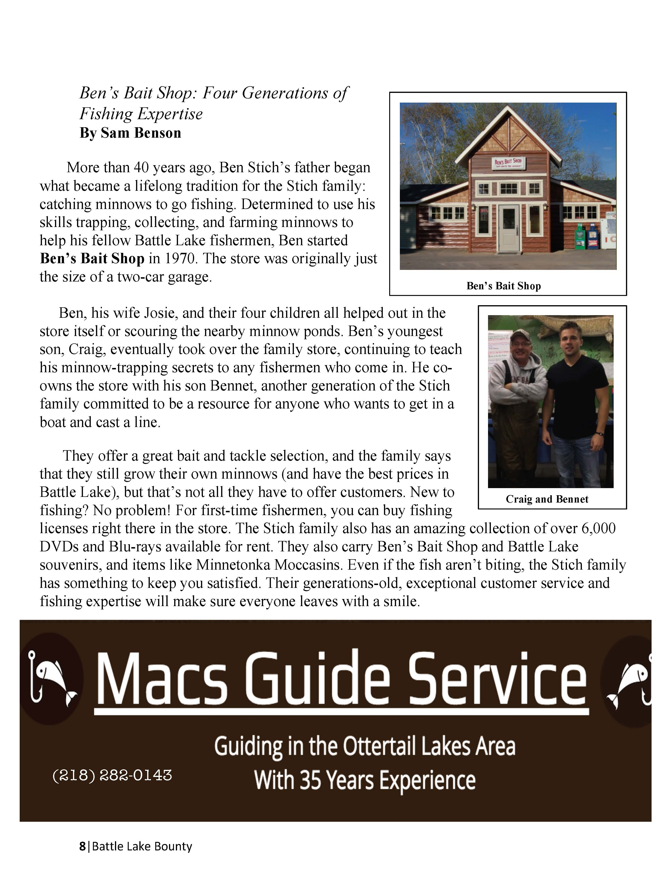

<body>
<h1>Sam Benson's Technical Communication Portfolio</h1>
<h3>Magazine Redesign</h3>

<b>Context:</b> Designing a magazine page for my Document and Information Design class. The document’s information was modified from an existing website.

<b>Strengths:</b> The website’s layout had pictures and text changing positions, so I moved all the pictures over to the right side of the document for consistency. I rewrote the passages, getting rid of the repetition, unnecessary asides, and grammatical errors.

<b>Weaknesses:</b> The ad is cut off, and does not reach the edge of the page. Important information on store products could get lost in the middle of the paragraph.

<bold>What I'd Do Differently:</b> I would create a more colorful style to draw readers’ attention more. The rhetorical question-and-answer in the last paragraph interrupts the flow of store product information, and should be deleted.

<h3>Market Study</h3>

<b>Context:</b> Analyzing South Africa’s market for online classes, using Geert Hofstede’s cultural dimensions.

<b>Strengths:</b> My writing is clear. The pictures are relevant, and there is enough space separating pictures and text. The data I found supports my calling for more online classes in South Africa. The important ramifications of apartheid government in the present day are brought to the forefront.

<b>Weaknesses:</b> The pictures sometimes push my text to the edges of the document, which is awkward to read. Headings being the same size as other text means users can’t find them as easily as they could.

<b>What I'd Do Differently:</b> I would make pictures big enough to stretch across the length of the document. That would make them easier to see, and keep pictures and text more separated.

<h3>Mobile Site Redesign</h3>

<b>Context:</b> Redesigning a mobile website’s layout for my Technical Communication in International Contexts class. I modified Distance Learning Portal’s mobile website, where students around the world could find online courses.

<b>Strengths:</b> As the mobile website was a worldwide service, my redesign took out excess language, which made it clearer to understand. To add more color, I made the discipline boxes blue. I also added an additional search bar, where students could find out what people from their country had to say about the service.

<b>Weaknesses:</b> Overall design limited by inexperience in Adobe InDesign. The university logos are blurry and unprofessional.

<b>What I'd Do Differently:</b> In some areas, this redesign did not go far enough. I did not design my own icons, even though a few of them were not very clear, so I would adjust the more confusing icons to be clearer for a global audience. I would also fix the blurry logos.

<h3>Literature Review</h3>

<b>Context:</b> Reviewing the literature of creativity’s value in technical communication. This literature review focuses on three contexts: the value in text, the value in the classroom, and the value in the workplace.

<b>Strengths:</b> The document constructs a coherent narrative using sources across three decades, tracing the foundation of creativity becoming more focused on in technical communication to the creative barriers employees face today. It connects its sources by putting them into a conversation, which highlights the gap between the academy and the workplace.

<b>Weaknesses:</b> 
The document is longer than it needs to be. The section on the value of creativity in the technical communication classroom dwarves the other main sections.

<b>What I'd Do Differently:</b> 
This piece is longer than it needs to be, and could do with another round of revision. Revising would trim down the overlong section detailing the value of creativity in the technical communication classroom.

